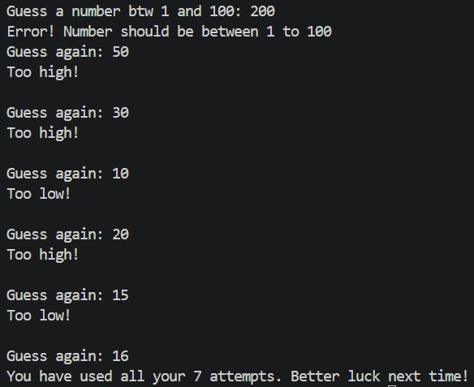

# 🎯 Number Guessing Game

A beginner Python mini-project where the computer randomly selects a number between **1 and 100**, and the player has **7 attempts** to guess it correctly.

## 🚀 Features

* Random number generation using `random.randint()`
* Input validation (only accepts numbers between **1–100**)
* Hints after every guess:

  * 📉 Too low
  * 📈 Too high
* Maximum **7 attempts**
* Displays the number of attempts taken if the player wins

## 🛠️ Built With

* **Python 3**
* `random` module

## ▶️ How to Play

1. Run the Python file.
2. Guess a number between **1 and 100**.
3. Follow the hints to get closer to the correct number.
4. Win before your **7 attempts** run out!

## 📷 Sample Gameplay

> 

## 📚 Concepts Practiced

* Variables & data types
* User input with `input()`
* `while` loops
* `if-elif-else` conditionals
* Random number generation
* Input validation
* Attempt counter & game logic

---

### 💡 Future Improvements

* [ ] Easy / Medium / Hard difficulty
* [ ] Show attempts remaining
* [ ] Play Again option
* [ ] Best score tracker

⭐ This is my second beginner Python project while learning programming.
